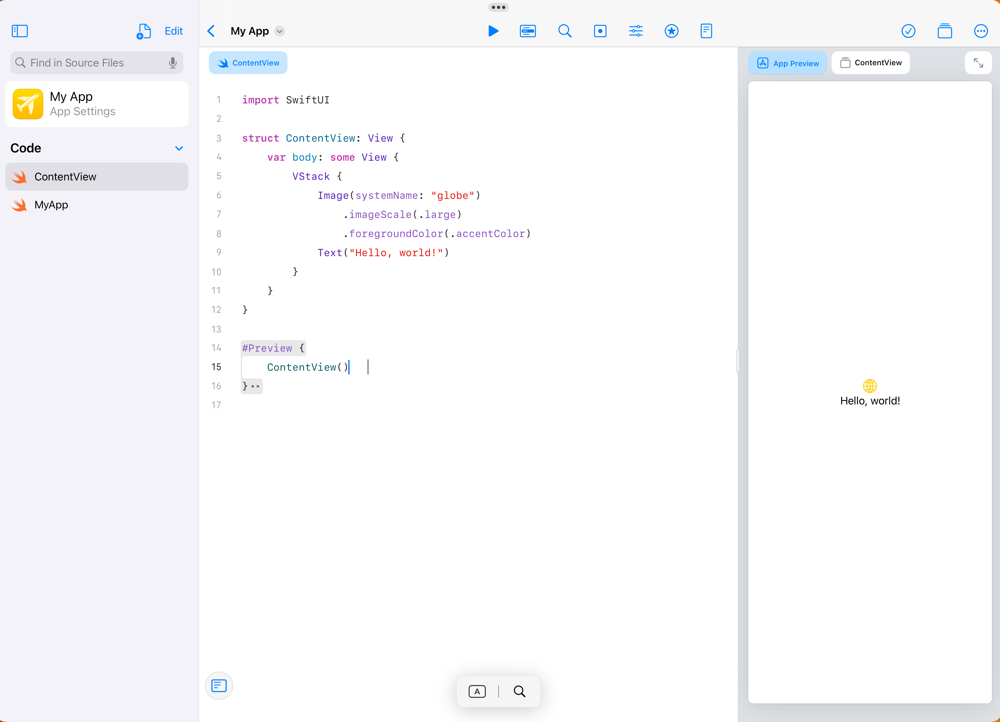
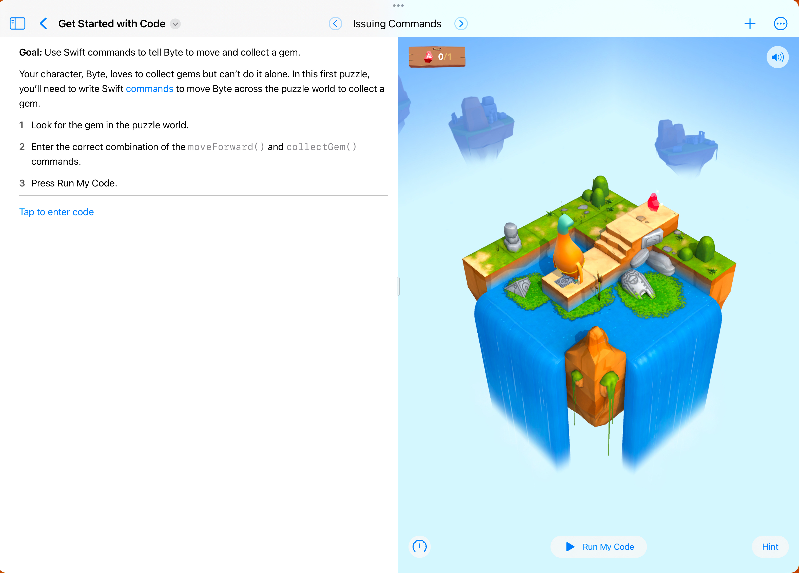
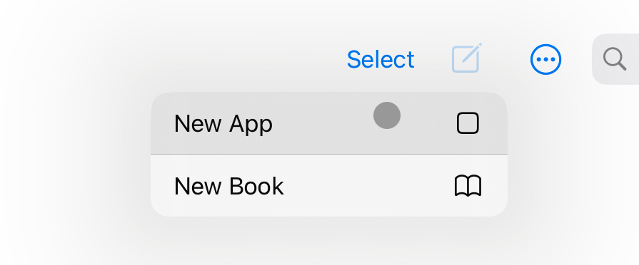
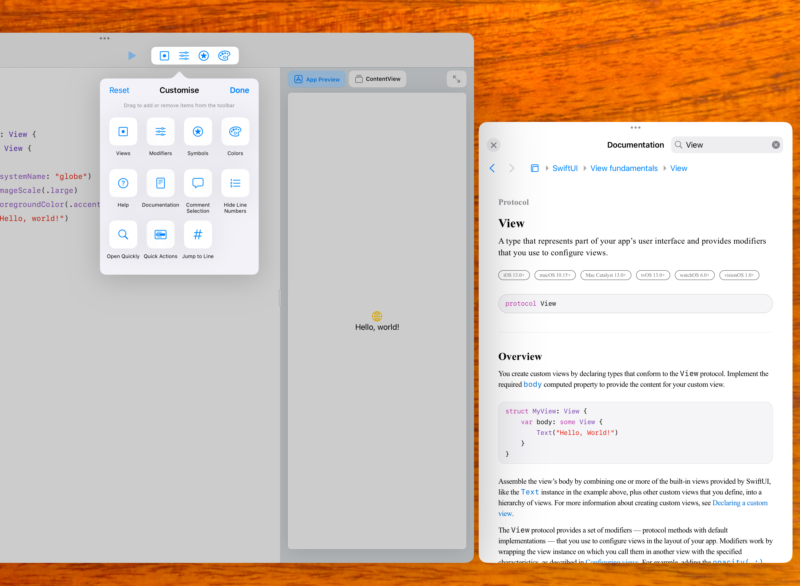
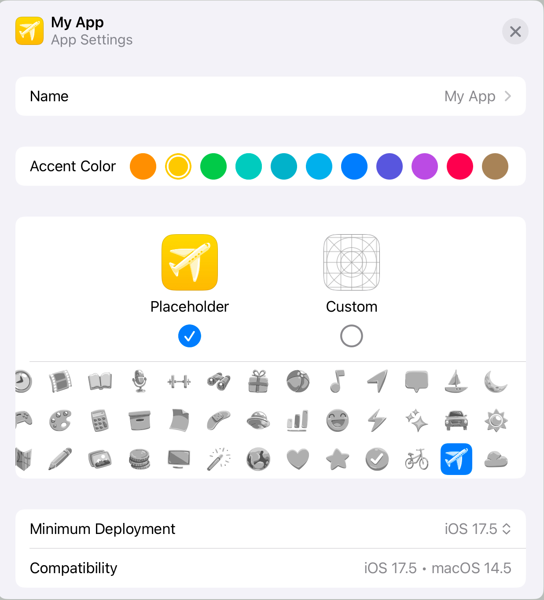
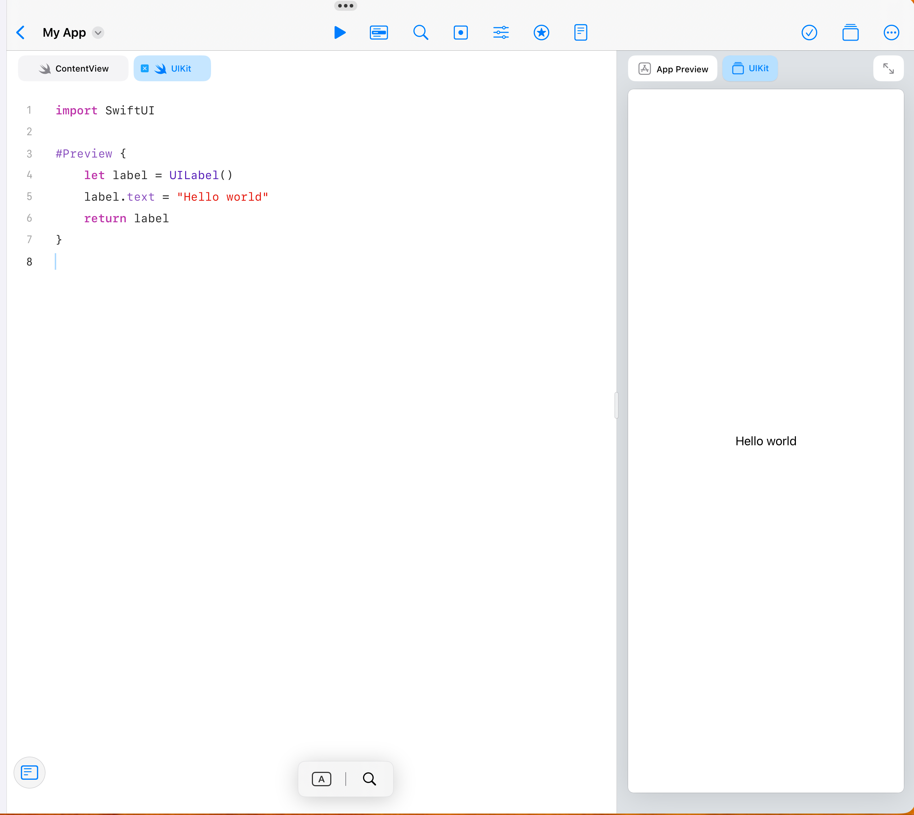
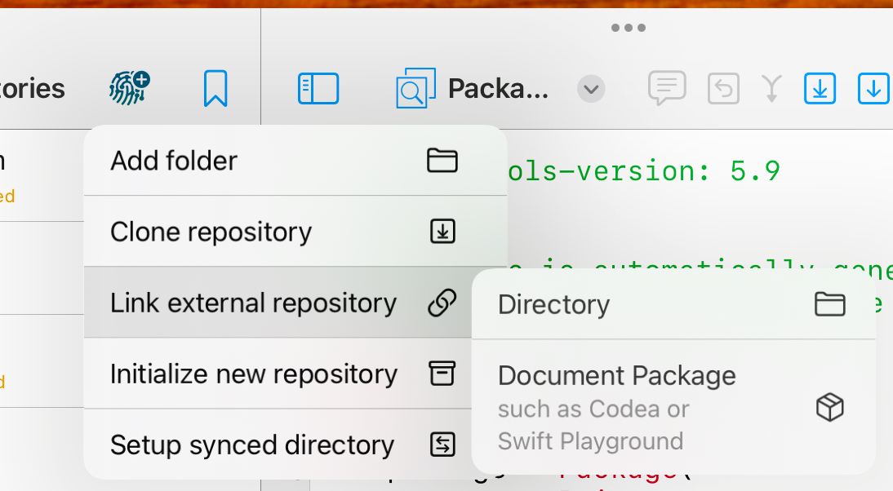
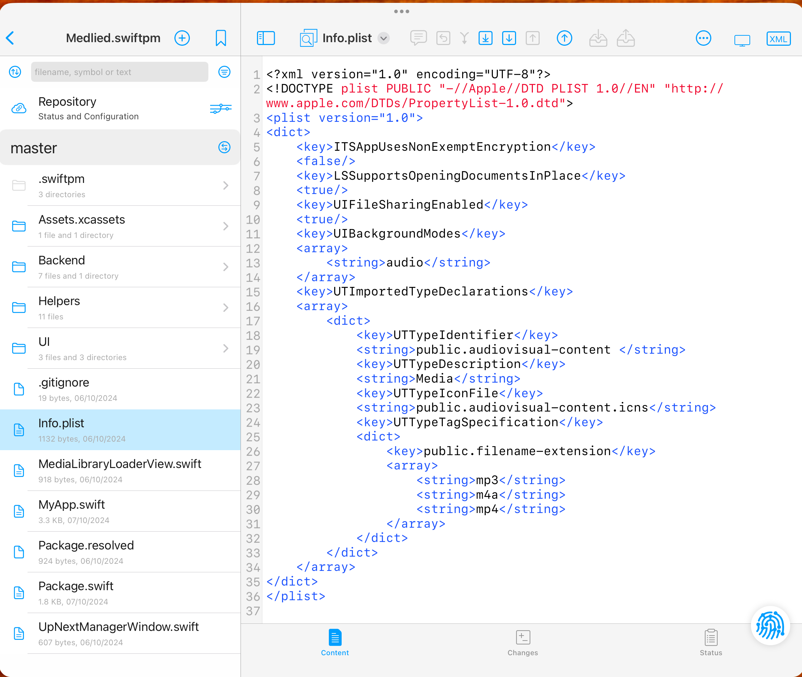
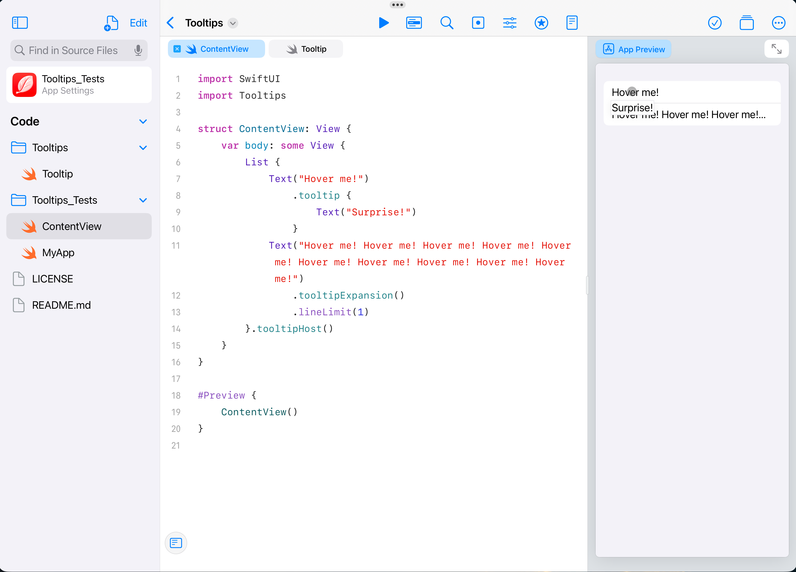
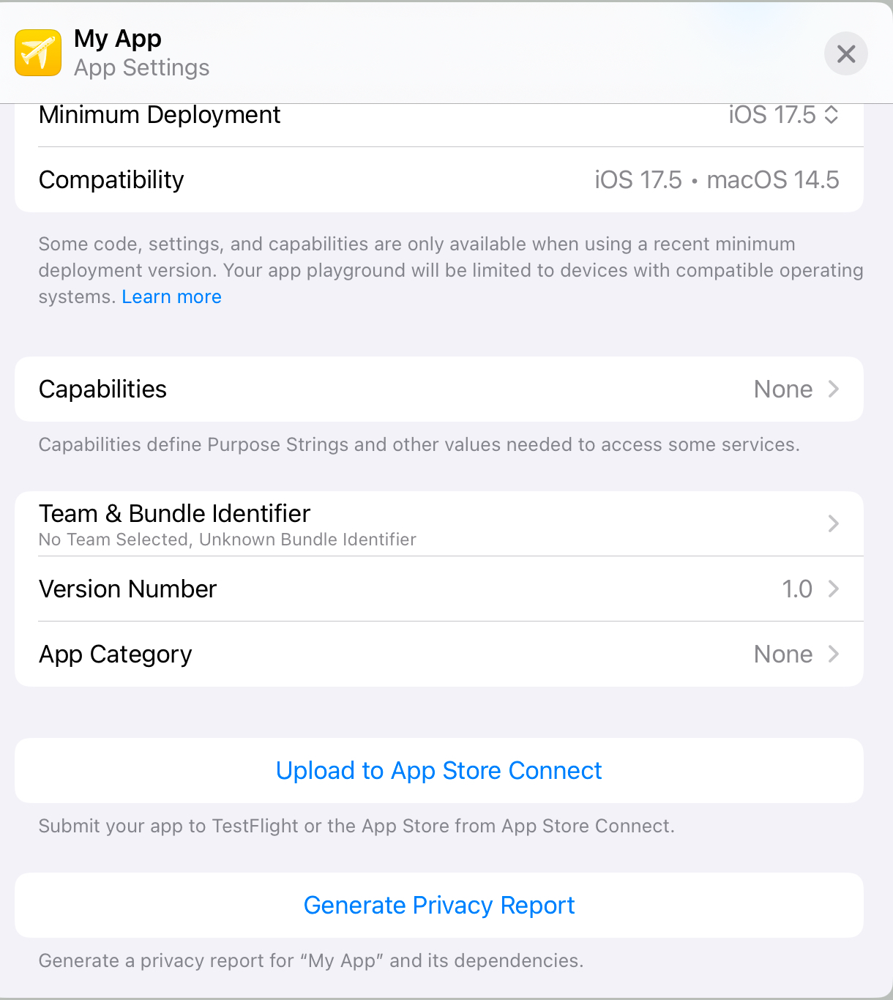

In the last year, I've gone all-in on building apps using an iPad. I've never met another Playgrounds developer, and a lot of the community are surprised this is even possible!

This post should clear up what is and isn't possible when it comes to app development on iPad, and I hope to encourage others to give this a try too!

I use my iPad hooked up to a keyboard, mouse, and monitor for most serious work, with both screens set to More Space. It's very much comparable to how most people would use their Mac. For more on why my primary device is an iPad, see my post on [iPadOS vs macOS]().


# What is Swift Playgrounds?

Swift Playgrounds is to Xcode, what Garageband is to Logic Pro. It's a fully capable IDE, that's easier to use, but doesn't have all the features of its older sibling.



Swift Playgrounds was, and still is, pitched as an educational tool by Apple. It can also work with "Playground Books", an educational format where users can be guided through the basics of coding.


Since Swift Playgrounds 4, Apple introduced a new app project format across Playgrounds and Xcode, based on Swift Package Manager. A `Package.swift` file defines the structure of the entire project, similar to how one would declare a Swift Package. Unlike Swift Packages though, the whole project is bundled into a `.swiftpm` bundle  - a folder dressed up to look like a file.

I fully expect Apple is working on Xcode for iPad, along the same lines as how they've brought Final Cut and Logic Pro. However, for now, Swift Playgrounds is what we've got to work with.

# Getting started



To begin, create a new app project! Expand the project navigator sidebar, and you're set. It's that easy!

# Features

## The editor

Swift Playgrounds supports many of the features you'd expect from Xcode. You can add files, folders, supporting files, and package dependencies. `.xcasset` files are supported, but managed automatically and hidden from the UI. `Info.plist` files are also supported, but require a bit of setup (I'll get on to this later). App tint colours and icons can be customised manually.



Keyboard shortcuts match Xcode where equivalent functionality is available, such as opening the documentation window or the Open Quickly search popup. The toolbar is customisable, which I hope to see come to Xcode!



You can also edit app metadata like icon and the app-wide default tint colour, by selecting the Package name at the top of the project navigator sidebar.

## Previews


App previews display as they do in Xcode, but Swift Playgrounds actually has two extra superpowers. First, Swift Playgrounds is much more proactive about rebuilding previews as changes are made, very rarely requiring the hitting of a reload button like in Xcode. Second, your entire app is recompiled live, and displayed on the side as a preview!

It is still possible to run the app in a separate window by hitting the run button in the toolbar. However, to test multi-window apps you'll have to run a build through Testflight.

## Swift

As the name suggests, only Swift is supported in Swift Playgrounds. If you're willing to use a new project format, it's likely you're starting a new project, and wouldn't want to use Objective-C anyway.

## UIKit



There seems to be a pre-conception that Swift Playgrounds only supports SwiftUI. UIKit is fully supported too!

Any framework you might import to an Xcode project is available.

## Git versioning

It is possible to use Git with Swift Playgrounds! My recommendation of Git client is Working Copy, as it lets you form a git repo in-place in the filesystem. I'd prefer a more traditional UI with a focus on the branch tree, but while options are available, they tend to prefer to pull the whole project into their own sandbox.

 To set up a repo for your SwiftPM project, select the Add Repo button in Working Copy, "Link external repository", and select "Document Package".



As a bonus, Working Copy allows editing the files within the SwiftPM bundle directly, which unlocks a few extra capabilities…

## Info.plist

It's possible to add an `Info.plist` to a SwiftPM project.

1. Add an Info.plist file into the SwiftPM bundle folder.



2. Add the following to the bottom of the ".iOSApplication" product definition, adding a comma separator on the line above:

```swift
additionalInfoPlistContentFilePath: "Info.plist"
```

While the Package.swift file warns against manual editing, this is not an issue in practice for any version of Swift Playgrounds released to date.

## Building packages

It's also possible to build packages using Swift Playgrounds! This again requires some manual editing of the Package.swift.

To build a package using Swift Playgrounds, add a library target to your `Package.swift`, and set up the main app target to depend on it.

```swift
let package = Package(
    name: "MyPackage",
    platforms: [
        .macOS("14.0"),
        .iOS("17.0"),
        .tvOS("17.0"),
        .watchOS("10.0"),
        .macCatalyst("17.0")
    ],
    products: [
        .library(
            name: "MyPackage",
            targets: ["MyPackage"]
        ),
        .iOSApplication(
            name: "MyPackage_TestApp",
            targets: ["MyPackage_TestApp"],
            teamIdentifier: "",
            displayVersion: "1.0",
            bundleVersion: "1",
            appIcon: .placeholder(icon: .leaf),
            accentColor: .presetColor(.red),
            supportedDeviceFamilies: [
                .pad,
                .phone
            ],
            supportedInterfaceOrientations: [
                .portrait,
                .landscapeRight,
                .landscapeLeft,
                .portraitUpsideDown(.when(deviceFamilies: [.pad]))
            ]
        )
    ],
    targets: [
        .target(
            name: "MyPackage",
            path: "MyPackage"
        ),
        .executableTarget(
            name: "MyPackage_TestApp",
            dependencies: [
                "MyPackage"
            ],
            path: "MyPackage_TestApp"
        )
    ]
)
```

This configuration asserts that files for "MyPackage" will exist in a "MyPackage" folder (as defined by "path"), and the app files will exist in "MyPackage_TestApp". You will need to create each, move your SwiftUI files to the app folder, and ensure the new library folder contains at least one valid Swift file, to get the project building.

While we can't get rid of the main app target entirely, here we're repurposing it as a mini-app for testing the key functionality of your library. If your library doesn't have much UI, you could even have the app display unit test results live in the previews area!



Once you're happy with your library, using your Git client of choice to push it up to Github, and add the Github repo as a dependency to your main app! If you prefer, you can even add the library target directly to your main app, to edit both in a single project.

## Upload to App Store Connect



Once you're happy with your app, Swift Playgrounds contains a button to upload the build directly to App Store Connect. If the app does not yet exist on App Store Connect, Playgrounds will allow you to create it as part of the upload. Make sure to set your app's version number before upload!

Where in Xcode, you'd have to increment a build number for each build, Swift Playgrounds handles this for you.

# The drawbacks

Swift Playgrounds does have a few limitations.

## Breakpoints

The one I run into most often is the lack of breakpoints. While sometimes a crash will provide a stack trace, I've been finding this functionality increasingly flakey. However, for the most part `print` statements get me by.

## Targets

Another limitation is the lack of support for targets and schemes, which are critical for supporting (native) unit tests and UI tests. This rules out using Playgrounds for certain extension types, where the best you'll get is moving most of the extension's code into a library.

However, for unit tests with properly mocked dependencies, **previews** can be converted into a means to display unit test results, which has the added benefit of appearing contextually as you edit the file and displaying results live as you type. I've created a few small packages to support this which can be found on my Github, though I've not yet used them in earnest in a project.

## Simulators

Swift Playgrounds does not support simulators. This is perhaps the most critical omission, but not for the reason you might think. You can test at most device sizes simply by running the app, and resizing the window using Stage Manager. This makes iPad the ideal environment for developing well-behaved, resizable apps.

However, it's when it comes to a release that the lack of simulators reveals itself to be an issue. Good luck resizing a window to the pixel-perfect dimensions of a specific device for taking App Store screenshots! I've also created a small package to work around this, which can take screenshots with the environment set to simulate specific device dimensions, safe area insets, and display scales, but unfortunately SwiftUI modals completely ignore the environment and do their own thing.

## Update schedule

The update schedule for Playgrounds can only be described as "Whenever the team feels like it". You typically have a 1-2 month wait from the new major OS releases, to actually being able to make use of the SDKs in Playgrounds.

There is one exception to this. In 2023, Apple shipped a TestFlight build at WWDC with support for the new SDKs, which showed alongside the Xcode beta download on developer.apple.com. But that's all we got. In September, a week before the new OS versions shipped, this single TestFlight build expired at 3 months old, leaving us without any way to even edit the projects we'd updated to the new releases.

# Conclusion

Swift Playgrounds is a fully capable replacement for Xcode, and it's opened up coding as an option again on my primary device. Xcode has been the only reason I ever pick up my Mac for the last few years, and I'm keen to cut out the need for it - if you've ever installed Windows on your Mac for gaming, you know the feeling. The one, single roadblock to going all-in on Playgrounds will be taking screenshots for the App Store, of all things, but I'm sure this is a surmountable problem.
