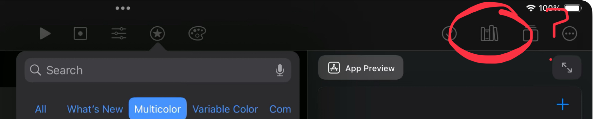
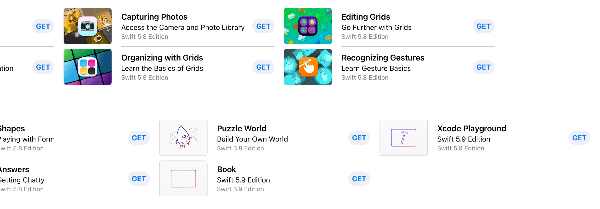

Apple has released the [long-awaited](()) [Swift Playgrounds 4.6 update](https://apps.apple.com/app/id908519492)!

The release notes read as follows:

> This update includes a new document browser to easily create a new playground or find a recent one, and provides bug fixes and improved stability.

Let's see what's new!

# iOS 18 Support!

Despite the description, the update does include support for targeting SDKs up to iOS 18.1.

## Interface changes

The update also includes the new document browser demoed in June last year which is a big win for organising projects! I just don't understand why it's taken this long.



The updated App Store screenshots also include a mysterious new toolbar item in the app editor, which looks like a set of books on a bookshelf. However, this button seems completely absent in the update itself! Is Apple withholding new features?

## “Bug fixes”

The release notes claim this update includes bug fixes, but the most severe bugs like jumping to types directly using Open Quickly, or the typing into text fields in the previews area, are still broken, so I'm not sure what they claim to be fixing here.

## Swift 6?

New projects still make use of Swift tools version 5.9 by default. However, Swift 6 appears to be enabled by default.

The following code compiles in the new IDE:

```
protocol NonCopyableProtocol: ~Copyable {
    
}

func typedThrows() throws(NSError) {
    
}
```

Despite this, every learn-to-code template seems be listed as “Swift 5.8 Edition”, suggesting Apple intend to update them piecemeal down the road. Why they've not managed to update even one in the 4 months since Swift 6 went live is anyone's guess! At least they've put in the work to update the “Playground” and “Book” templates listed right at the end though, which are listed as “Swift 5.9 Edition”.

